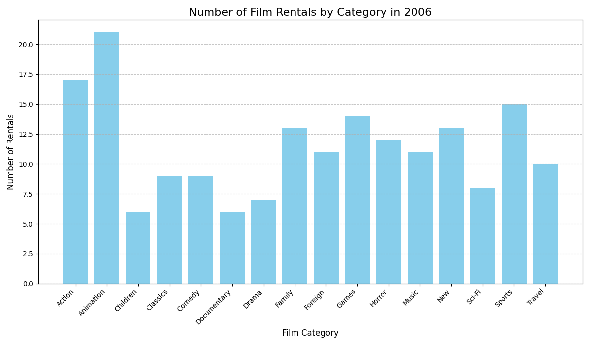

# 🎬 Movie Database Project (MySQL + Sakila)

This project demonstrates SQL skills using the **Sakila Movie Database**, a sample dataset provided by MySQL.  
It contains data about movies, actors, film categories, rentals, stores, and customers.  
The project highlights **relational schema design**, **complex queries**, and **business insights** through SQL.

---

## 🚀 Features
- Sample relational database with movies, actors, categories, rentals, and payments  
- Example analytical SQL queries (joins, aggregates, group by, etc.)  
- Insights into **rental activity** and **film categories**  
- Visualization of query results  

---

## 📂 Project Structure

